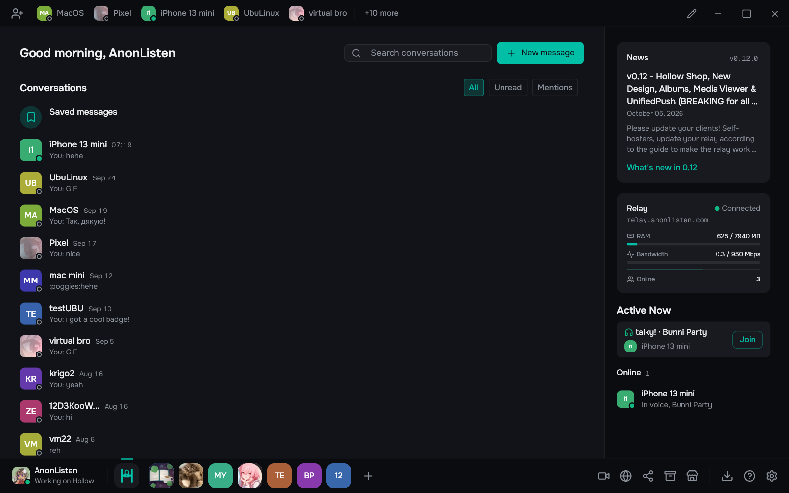

<p align="center">
  
</p>

<h1 align="center">Hollow</h1>

<p align="center">
  Distributed, encrypted communication. No accounts, and no server that stores your messages.
</p>

<p align="center">
  <a href="https://github.com/VitalikPro13/HOLLOW/releases/latest"></a>
</p>

<p align="center">
  
</p>

Hollow is fully distributed, end-to-end encrypted communication software. There are no central servers that store your messages or files. Members of a server collectively host it. The relay forwards encrypted blobs between peers. It cannot read or modify them, and it never writes them to disk.

Your identity is a cryptographic keypair. Zero registrations. One recovery phrase, or an export of your identity into a .hollow file, and you own your account forever.

## Features

### Privacy and identity

- No accounts. Your identity is an Ed25519 keypair from a BIP-39 recovery phrase, with no email, phone number or password.
- Direct messages use Olm (Double Ratchet) and servers use OpenMLS, both with forward secrecy by default.
- One identity on your phone and your desktop, linked with a short code, with messages, servers and friends kept in sync. If you lose a device, you can remove it from any other one.
- Every message is signed with Ed25519, so an exported conversation can't be forged.

### Messages and files

- Messages sent while you're offline are waiting when you come back. The relay holds them as ciphertext, in memory only, for a short time.
- Files up to 34 MB go straight between devices. Larger ones use Hollow Share, which spreads the transfer across peers the way BitTorrent does.
- Vault splits encrypted files into erasure-coded shards across server members, so a file survives when some of them go offline.
- The Archive tab shows every message in your local encrypted database, and you can export all of it.

### Calls

- Peer-to-peer voice and video calls over WebRTC, encrypted frame by frame with SFrame (AES-128-GCM).
- Noise suppression runs on your device (RNNoise, plus DeepFilterNet3 on desktop), along with loudness leveling and fullband Opus. No cloud service ever touches your audio.
- Screen sharing keeps text readable, because our patched WebRTC encodes screens as screen content (AV1 or VP9) instead of webcam video. Game or music audio gets its own Opus stream, with per-app capture available.

### Communities

- Servers with text and voice channels, roles and permissions. Their state syncs between members through signed CRDTs, with no central copy.
- Public channels that anyone with the server ID or a join link can read without joining, in the app or on the [website](https://hollow.anonlisten.com/).
- Optional Twitch verification, to limit a server to your followers or subscribers.
- Avatars, banners and frames from independent artists in the [Hollow Shop](https://shop.anonlisten.com/). You buy on the artist's Ko-fi page, and Hollow takes no cut.

## Security

The relay can't read messages, files, profiles or calls. It can't forge anything either, because every frame it forwards is signed by the device that sent it. It does see routing metadata: device IDs, IP addresses, which devices share a room, when they send and how much, and a phone's push token. All of that stays in memory and is never logged to disk. The whitepaper lists [exactly what the relay sees](WHITEPAPER.md#127-what-the-relay-sees) and covers the [threat model](WHITEPAPER.md#23-threat-model).

If you find a vulnerability, please report it privately as described in [SECURITY.md](SECURITY.md).

## Download

| Platform | Links |
|----------|------|
| Windows (10+) | [.exe](https://anonlisten.com/hollow/releases/hollow-0.12.0-win64-setup.exe) / [.zip](https://anonlisten.com/hollow/releases/hollow-0.12.0-win64.zip) |
| macOS (12+) | [.dmg](https://anonlisten.com/hollow/releases/hollow-0.12.0.dmg) |
| Linux | [Flatpak](https://anonlisten.com/hollow/releases/hollow-0.12.0-linux-x86_64.flatpak) / [.tar.gz](https://anonlisten.com/hollow/releases/hollow-0.12.0-linux.tar.gz) |
| Android (7+) | [.apk](https://anonlisten.com/hollow/releases/hollow-0.12.0-android.apk) |
| iOS (16+) | [TestFlight](https://testflight.apple.com/join/5YG2S5e8) |

What changed in each version is on the [releases page](https://github.com/VitalikPro13/HOLLOW/releases).

## Self-hosting

Hollow supports self-hosted relays for fully isolated networks. Only the people connected to your relay can reach each other, and the official network is not involved. You need a VPS with a public IP and about twenty minutes. The address can be a free DuckDNS name, so there is nothing to buy, and the certificate is obtained and renewed for you.

```bash
git clone --recurse-submodules https://github.com/VitalikPro13/HOLLOW.git
cd HOLLOW/relay-uws
cp .env.example .env              # set your address, TURN secret and email
docker compose up -d
```

Then point the app at it in Settings, under Network. [relay-uws/SELF_HOSTING.md](relay-uws/SELF_HOSTING.md) is the full guide, including what a self-hosted relay does not have. If your relay is older than 0.12, follow [Moving to 0.12](relay-uws/SELF_HOSTING.md#moving-to-012) before your members update the app.

The relay is written in C++ on uWebSockets. It handles TLS 1.3 itself, with no reverse proxy, and fits about 572,000 concurrent connections on an $8/month VPS ([BENCHMARK.md](relay-uws/BENCHMARK.md)).

## Documentation

- [Whitepaper](WHITEPAPER.md): the full protocol specification, covering cryptography, networking, and the threat model
- [Privacy Policy](legal/PRIVACY_POLICY.md): what data exists, where, and what we can access (nothing)
- [Terms of Use](legal/TERMS_OF_USE.md): plain-language terms
- [Relay Documentation](relay-uws/README.md): relay architecture, benchmarks, deployment
- [Legality Research](legal/legality.md): age verification, illegal-content/CSAM liability, encryption regulations, legal precedents (US/UK/EU)
- [Transparency Report](legal/transparency_report.md): legal requests received and data disclosure

<details>
<summary><strong>A note from the creator</strong></summary>

<br>

> When I started working on Hollow back in February, I didn't think how large this project would become. It all began with a random thought during school about having a fully peer-to-peer messenger where you're in control of all your data. Then I started planning, researching, locking in the tech stack, and grinding more than full-time to build it.
>
> You can look at the old commits. I tried libp2p that kept failing and then the layout has been rebuilt too. Claude was basically my development tool that always helped me. I might not be the best programmer, but I have engineering thinking and creativity to know what needs to be built and how. Every architecture decision was mine, I traced every bug/performance issue and then we fixed it together, but I'm the one who's in control of what I release. And I'm not planning to publish unusable software that works like total garbage.
>
> As for Hollow, I made it open-source because I want people to have software they can trust, own a copy of, and run themselves. It should be accessible to every regular user who just wants to chat with their friends, with everything working out of the box and have actual privacy/security that's easily verifiable. This is the reason why I adopted modern E2EE protocols and built custom implementations to create the messenger I would want to use myself.
>
> Hollow won't have paywalls. Ever. No matter how much money someone is willing to pay, Hollow will stay open for everybody. Contributors are welcome because we can come together on a single matter that is taken away from us every single day: privacy and ownership. You deserve it. Don't let anybody tell you otherwise.
>
> Thank you for reading, and as always, let's strive for better software together.
>
> -- Vitalii Rovinskyi (AnonListen / VitalikPro13)

</details>

## Contributing

<a href="https://sonarcloud.io/summary/overall?id=VitalikPro13_HOLLOW"></a>
<a href="https://codecov.io/gh/VitalikPro13/HOLLOW"></a>

Contributions are welcome. See [CONTRIBUTING.md](CONTRIBUTING.md) for setup instructions, coding conventions, and how to submit a pull request.

- Report bugs and request features via [Issues](../../issues)
- Read the [Whitepaper](WHITEPAPER.md) for protocol-level context
- Report security vulnerabilities privately: see [SECURITY.md](SECURITY.md)

## Building from source

Hollow is Flutter (Dart) for the interface and Rust for networking, cryptography and storage, joined by flutter_rust_bridge. Local data lives in SQLCipher, an encrypted SQLite. [BUILDING.md](BUILDING.md) has what each platform needs and how to build it, for Windows, macOS, Linux, Android and iOS.

## License

Copyright (C) 2025-2026 Vitalii Rovinskyi <vitaliy2007rova@gmail.com>

The Hollow client and core library are licensed under the [GNU Affero General Public License v3.0](LICENSE). The relay server ([relay-uws/](relay-uws/)) is licensed under the [MIT License](relay-uws/LICENSE).

The AGPL lets anyone, companies included, use, modify and run Hollow for free. If you share a modified version, or let people use one over a network, you publish its source.

Organizations that want support, custom development, a hosted relay, or terms other than the AGPL can write to [collab@anonlisten.com](mailto:collab@anonlisten.com).

The Hollow name, logo, and branding are trademarks of AnonListen and are not covered by the open-source license.

## Support the project

Hollow is funded by the community, not by selling your data. Any support is appreciated.

- [Ko-fi](https://ko-fi.com/anonlisten)
- [Patreon](https://patreon.com/anonlisten)
