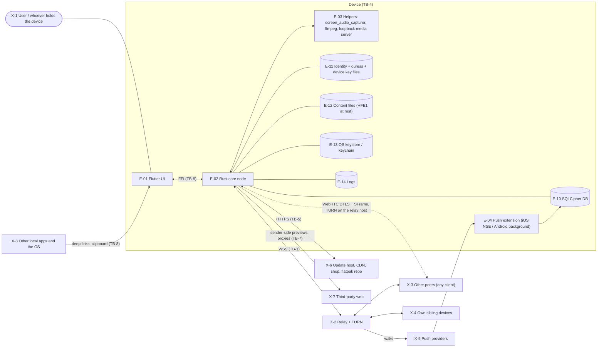

# Hollow threat model

Audit phase A, written 2026-09-26. Answers Shostack's first question ("what
are we working on?") precisely enough that phase B (the authorisation matrix)
and phase E (STRIDE per element) can walk it cell by cell. Claims live in
`claims.md`; this file says who attacks them, what they want, where the trust
boundaries are, and how data crosses them.

Items marked **(verify B)** are my reading of the design from the whitepaper
and CLAUDE.md, not yet checked against code. Phase B checks every one.

---

## 1. Attackers

**Standing rule: every peer attacker runs a client of their own making.**
They hold valid keys for their own identity and sign their messages
correctly. That profile found HOL-SEC-001. The question is never "is it
signed" but "is the signer allowed".

| ID | Attacker | Can | Cannot (assumed) |
|---|---|---|---|
| P-01 | **Hostile relay operator.** The official operator, anyone running a self-hosted relay, anyone who compromises a relay host. Fully active. | Read every relay-visible byte and JSON command; drop, delay, reorder, replay, duplicate; inject frames with any sender field; lie about room membership and presence; run its own identities; see IPs; issue TURN credentials. | Break TLS to other hosts; break Ed25519, X25519, AES-GCM; read what is end-to-end encrypted without a key it was handed. |
| P-02 | **Network attacker.** Wi-Fi, ISP, state. | Observe and tamper with traffic outside TLS/DTLS; see timing, sizes, IPs, DNS. | Break TLS with a valid chain. |
| P-03 | **Stranger who knows an id.** Got it from a server, a screenshot, an invite. | Join guessable rooms (inbox, DM room codes (verify B)), send friend requests, profile syncs, key exchange, any envelope a non-friend can reach. | Anything that needs membership or friendship. |
| P-04 | **Malicious friend.** Accepted friend with Olm sessions. | Everything P-03 can, plus DMs, files, calls, profile and device-list traffic, sync requests. | |
| P-05 | **Malicious server member, admin or owner.** | CRDT ops at their role, MLS messages, channel traffic, KeyPackages and commits, conference traffic, public channel posts. | Ops above their role, if the gates hold. |
| P-06 | **Formerly trusted peer.** Ex-friend, blocked identity, kicked or banned member, removed from a restricted channel. | Replay what they once legitimately held; keep old keys and state. | |
| P-07 | **Own sibling device, still linked.** | Everything the identity can do: it holds the master key (WP 3.6). | |
| P-08 | **Own revoked device**, lost or stolen and usable. | Holds the master key and device key; can sign as the master (see AT-2). | Use them while password-locked and powered off (verify B). |
| P-09 | **Physical holder of a device.** Thief, border search, forensic lab, coercer. | Copy the disk, run forensic tools, attempt PINs offline, compel the user to unlock. | Break the OS keystore or Secure Enclave. |
| P-10 | **Hostile infrastructure other than the relay.** Update and download host, asset CDN, shop backend, TURN, a member running the media forwarder. | Serve any bytes; see IPs; forward media ciphertext. | Produce signatures with keys it lacks. |
| P-11 | **Push providers.** Apple, Google, a UnifiedPush distributor. | See every wake-up payload, its timing, device tokens. | |
| P-12 | **Third-party websites.** Link targets, Klipy, FFZ, IGDB, invite link host. | See requests made to them, serve hostile content (HTML, images, video). | |

---

## 2. Assets

| ID | Asset | Worst outcome |
|---|---|---|
| AS-01 | Master identity key | Someone else becomes you, permanently. |
| AS-02 | Device keys | Someone else authenticates as your device. |
| AS-03 | Session and group secrets (Olm sessions, MLS epochs, SFrame keys, file keys) | Past or future content readable. |
| AS-04 | Content: DMs, channel messages, files, media, profiles | Read, altered, forged. |
| AS-05 | Metadata: who talks to whom, which devices are one person, presence, push tokens, IPs | Social graph and activity exposed. |
| AS-06 | Device integrity: not wiped, locked out or bricked | Data destroyed, user locked out of their own identity. |
| AS-07 | Server state: membership, roles, channels, ownership | Server taken over, members expelled or added. |
| AS-08 | Data at rest: DB, content files, logs, keystore entries | Readable by the device's holder. |
| AS-09 | Code integrity: updates, flatpak repo, helper binaries | Attacker code on the user's machine. |
| AS-10 | The user's perception: names, verification state, notifications, links | User tricked into trusting the wrong party. |
| AS-11 | Availability of the relay and of a client | Service denied, sync wedged, a client crashed remotely. |

---

## 3. Trust boundaries

| ID | Boundary | Why it is one |
|---|---|---|
| TB-1 | Client and relay | Everything the relay handles is attacker-controlled (P-01). |
| TB-2 | Peer and peer | Every other identity is a separate principal (P-03 to P-06), whichever transport carries it (MLS, Olm, plaintext twin, public channel, relay topic, sync, WebRTC). |
| TB-3 | Own identity and its devices | Siblings are trusted with the master key; a revoked or stolen one is P-08. |
| TB-4 | Hollow and the device's storage and OS | Disk, keystore, other apps, whoever holds the device (P-09). |
| TB-5 | Hollow and its distribution | Update host, CDN, flatpak repo (P-10). |
| TB-6 | Hollow and push providers, and the push extension process | P-11; the iOS NSE decrypts in a separate process. |
| TB-7 | Hollow and third-party web | P-12. |
| TB-8 | The Hollow process and local helpers | `screen_audio_capturer`, ffmpeg, the loopback media server, deep links from other apps. |
| TB-9 | Rust core and Dart UI (FFI) | Same process, same trust; the boundary matters for WHERE a check lives: Dart must never be the only place an authorisation decision is made. |
| TB-10 | The relay process and its host | The memfd snapshot, systemd, the kill list and rings in RAM. |

---

## 4. Context diagram

The peer-to-peer boundary TB-2 is logical: it rides inside the relay and
WebRTC flows. The rest of this file breaks each area into its flows.

---

## 5. Flows, by area

Every flow crossing a boundary, with what protects it today and the
authority question phase B must answer for it. Each flow will get one or more
rows in `authz_matrix.md`.

### 5.1 Identity and devices

| ID | Flow | Crosses | Protection today | Authority question |
|---|---|---|---|---|
| F-01 | Signed device list, on profile sync | TB-2, TB-1 | Master signature, monotonic version, union merge; foreign lists filtered by `speaks_for` (branch) | May this master name these device ids? |
| F-02 | Revocation to the revoked device, which then wipes | TB-3 | Master signature; own-master sibling path only (branch) | Is a signature by the master enough when every device holds the master (AT-2)? |
| F-03 | `DestroyIdentity` order | TB-2, TB-3 | Master signature, `judge_own_order` (own master, targets, link time, in-process applied stamp) | Replay after restart? Link-time rule vs a stolen device? |
| F-04 | Relay kill list: order couriered on connect, `KillAck` back | TB-1, TB-10 | Relay is courier only; the order carries its own signature | Can the relay use withholding or ordering to cause harm? |
| F-05 | Relay authentication | TB-1 | Device key challenge; relay derives peer_id from the pubkey; 60 s window | |
| F-06 | Unlock, duress, app lock secret | TB-4 | Argon2id, both slots derived, keystore wrap | Offline PIN search (L-07) |
| F-07 | Sibling sync: DM backfill, read markers, personal emotes, server re-announce, manual sync | TB-3 | "Sender proven to be the same identity" | How is "same identity" proven, and can a stranger's device be resolved to our master (the HOL-SEC-001 rebinding class)? |
| F-11 | Link code claim and resolve (relay JSON, `link:{CODE}` room) | TB-1 | none: the code is in plaintext | HOL-SEC-002 |
| F-12 | Link snapshot stream (full backup incl. `identity.key`) | TB-1 | Argon2id + AES-GCM with the code or the public master id as passphrase | HOL-SEC-002 |
| F-13 | Link confirmation prompt | TB-3 | On-screen accept on the populated device | Does the prompt show enough to spot a stranger's request? |

### 5.2 Direct messages and friends

| ID | Flow | Crosses | Protection today | Authority question |
|---|---|---|---|---|
| F-20 | Olm `KeyBundle` / `KeyRequest` | TB-2, TB-1 | Device-signed, `REQUIRE_SIGNED_KEY_EXCHANGE`, recipient + freshness + device in the signed list | Non-contributory DH (L-02); is every key input signed? |
| F-21 | DM `MessageEnvelope` | TB-2, TB-1 | Olm encryption, master signature v2/v3 | Is the sender's master the one the conversation is with? |
| F-22 | Friend request and accept | TB-2 | Signed; `requested_at` binding; tombstones | May this identity create this row? Does the accept answer OUR request? |
| F-23 | DM sync request and response (watermark + GapDigest) | TB-2, TB-3 | Signed rows re-verified on ingest (verify B) | Can a friend inject rows into a conversation that is not theirs? |
| F-24 | 1:1 call signals (`CallSignal`) | TB-2 | Olm-encrypted, plaintext rejected | |
| F-25 | Profile announce (hashes) and `ProfileRequest` response (blobs) | TB-2 | Light announce, blobs only on request | Does a profile response only ever update the sender's own profile? |
| F-26 | Block list and reports | local | Master-keyed drop before store and emit | |

### 5.3 Servers and channels

| ID | Flow | Crosses | Protection today | Authority question |
|---|---|---|---|---|
| F-30 | CRDT ops over MLS, the plaintext `CrdtOpBroadcast` twin, and `0x07` topics | TB-2, TB-1 | `CrdtOp.auth` signature, `admit_remote_op` (author, HLC clamp, `op_allowed`) | Identical gate on all three transports? Does each op kind check authority over its TARGET (member, role, channel)? |
| F-31 | `ServerStateSnapshot` on join | TB-2 | Adopted while pending, clock-clamped | Who may hand a joiner the state it adopts? A malicious first responder? |
| F-32 | MLS KeyPackages, commits, proposals, Welcomes; `~join` ring | TB-2, TB-1 | OpenMLS; owner-preferred committer | RFC 9420 5.3.1 credential check at every entry (L-03)? Who may add or remove whom? |
| F-33 | Channel messages (MLS, subgroups for restricted channels) | TB-2 | MLS + master signature | |
| F-34 | Public channel messages and files | TB-2, TB-1 | Plaintext, signed | |
| F-35 | Channel sync and backfill responders, `FileRequest` channel arm | TB-2 | `channel_readable_by` | Every serving path gated? |
| F-36 | Channel push fan-out (`0x09`) | TB-1 | Sender computes targets | Can a member make the relay push to non-members? |
| F-37 | Conferences (`conf:{id}` virtual servers) | TB-2 | Admission is the MLS add | Can a guest choose a `conf:` id that collides with a real server? |

### 5.4 Calls, voice, screen sharing

| ID | Flow | Crosses | Protection today | Authority question |
|---|---|---|---|---|
| F-40 | VC and call signalling (`vc_*`, whitelisted), `screen_watch` | TB-2 | Whitelist; `inbound_origin_ok` | Can a member spoof another's `origin`, or join media without membership? |
| F-41 | Media over DTLS-SRTP + SFrame | TB-1, TB-2 | SFrame keys from the MLS exporter or the call key | Nonce uniqueness in shared-key mode (L-01) |
| F-42 | Media forwarder lane (`fwd:{id}`) | TB-2 | Zero ICE servers on client legs; originator trust | |
| F-43 | Screen-share audio over `0x03` (Opus) | TB-1 | (verify B: encrypted?) | |
| F-44 | TURN credentials over the authed WS | TB-1 | Short-lived, peer-locked coturn | |

### 5.5 Relay internals

| ID | Flow | Crosses | Protection today | Authority question |
|---|---|---|---|---|
| F-50 | Room join and leave, `RoomMembers` | TB-1 | Membership gate on every binary handler, `is_peer_id_shape` | Room names are guessable; which rooms may a stranger join? |
| F-51 | `0x03` broadcast, `0x07` topics, offline rings, availability cache | TB-1, TB-10 | Sender membership gate | |
| F-52 | memfd snapshot on SIGTERM | TB-10 | fd store, never disk | Snapshot codec parses its own output: fuzz target |
| F-53 | Push token registration and prefs | TB-1, TB-6 | Authed WS | Can one peer register or delete another's token? |

### 5.6 Push

| ID | Flow | Crosses | Protection today | Authority question |
|---|---|---|---|---|
| F-60 | Relay to FCM / APNs / UnifiedPush to device; NSE decrypts on device | TB-6 | `{wake, sender}` only; NSE reads the DB | What does `sender` reveal, and to whom? |

### 5.7 Distribution and updates

| ID | Flow | Crosses | Protection today | Authority question |
|---|---|---|---|---|
| F-70 | Manifest + detached signature, archive + SHA-256, install | TB-5 | Offline Ed25519 key, pinned digests, no downgrade, HTTPS | |
| F-71 | News and status feeds | TB-5 | Unsigned, display-only | Can a feed carry a link or text that misleads (AS-10)? |
| F-72 | Flatpak repo and bundles | TB-5 | GPG-signed OSTree | |
| F-73 | Linux update apply (`update.sh`, `flatpak-spawn`) | TB-8 | Hash-verified first | Arguments built from manifest fields? |

### 5.8 Files, assets, credentials, previews

| ID | Flow | Crosses | Protection today | Authority question |
|---|---|---|---|---|
| F-80 | `FileHeader` + file bytes (relay or WebRTC) | TB-2, TB-1 | Per-file AES-256-GCM, `safe_file_name`, `parse_id` | |
| F-81 | File pulls (`file_asks`), `file_unavail`, expiry | TB-2 | One holder, receipts, gate before answering | Can a peer mark someone else's file expired or unavailable? |
| F-82 | Asset rail requests and receipts | TB-2 | Content-addressed, receipt cap, unsolicited dropped | |
| F-83 | `.hollowpack` import; support and Twitch credentials | TB-2, TB-5 | Re-hash, pinned root, master sig required | |
| F-84 | Link previews (fetched by the sender, rendered by readers) | TB-7, TB-2 | Readers never fetch; digest recomputed | |
| F-85 | Klipy, FFZ, IGDB proxies (authoring) | TB-7 | Key server-side | |
| F-86 | Hollow Share and vault shards | TB-2 | Encrypt-then-erasure-code | Derivation of share keys (HOL-SEC-002 variant search) |

### 5.9 Local

| ID | Flow | Crosses | Protection today | Authority question |
|---|---|---|---|---|
| F-90 | FFI commands and events | TB-9 | | Any authorisation decision made only in Dart? |
| F-91 | Core to DB, content files, keystore | TB-4 | SQLCipher, HFE1, keystore | |
| F-92 | Loopback media server (`atRestMediaUrl`) | TB-8 | (verify B) | Can another local process, or a web page through the browser, read decrypted media from it? |
| F-93 | Deep links (`hollow://`) | TB-8 | `classifyHollowLink` | Can a link trigger an action without a confirm? |
| F-94 | Notifications, clipboard, screenshots | TB-4 | App-lock suppression | |
| F-95 | Logs shared for support | TB-4 | Rules against logging secrets | |
| F-96 | Helper processes (`screen_audio_capturer`, ffmpeg) | TB-8 | Separate binaries | Arguments derived from remote input? |

---

## 6. Attack trees for the worst outcomes

OR = any child suffices, AND = all needed. Leaves marked with the finding or
lead that covers them.

**AT-1: Silently wipe Alice's device** (AS-06)
- OR: a device list naming her device as revoked, from a foreign master: HOL-SEC-001, fixed on branch
- OR: a destroy order Alice's device accepts
  - forged by another identity (master sig, `judge_own_order`)
  - replayed after a restart (applied stamp is in-process only): L-06
  - signed with Alice's master key held by a stolen or linked device: AT-2
- OR: duress triggered remotely (local-only by design: verify no remote path)
- OR: any other path to `_selfNuke` / `SelfRevoked` / the wipe routine: enumerate in phase B

**AT-2: Take over Alice's identity** (AS-01)
- OR: obtain the master key
  - intercept a device link: HOL-SEC-002
  - steal a device whose keys are usable (keychain mode, or unlocked): by design, see AR-02
  - copy the identity file and break its protection: C-06
  - read it from logs, backups, crash dumps: C-37
- AND then (with the key): sign a higher-version device list un-revoking the
  attacker's device and revoking Alice's, and her honest devices wipe
  themselves. Alice has no way to reclaim the identity except a new one.

**AT-3: Read Alice's DMs** (AS-04)
- OR: get a device of the attacker's into Alice's contact's device list (C-01, C-10)
- OR: MITM the key exchange (L-02)
- OR: obtain the master key (AT-2)
- OR: be served DM rows by sync (F-23, sibling paths F-07)
- OR: read them at rest (AS-08)

**AT-4: Become owner or admin of Alice's server** (AS-07)
- OR: a CRDT op whose author or target check is missing (F-30)
- OR: a snapshot adopted from a malicious first responder (F-31)
- OR: an MLS add or remove that CRDT roles do not authorise (F-32)
- OR: a transport that skips the gate (twin vs MLS vs topic)

**AT-5: Run code on Alice's machine** (AS-09)
- OR: a malicious update (F-70, F-72, F-73)
- OR: memory corruption in a parser of peer bytes (libwebp, opus, symphonia, zip, HTML): fuzzing
- OR: a file written outside the data folder (C-29)
- OR: helper process arguments (F-96)

**AT-6: Learn who Alice talks to** (AS-05)
- OR: relay room membership and timing (accepted, see "what we do not promise")
- OR: push `sender` field to Apple or Google (F-60)
- OR: guessable room names let a stranger watch presence (F-50)
- OR: link device ids to one person despite WP 3.1 (C-24)

---

## 7. Still to do in this file (phase E)

- STRIDE per element over every E-xx and F-xx above, to the stopping rule.
- LINDDUN GO over F-50 to F-53 and F-60.
- The protocol checklists (RFC 9420/9750, RFC 9605, Olm, Sesame) against
  F-20, F-32, F-41.
